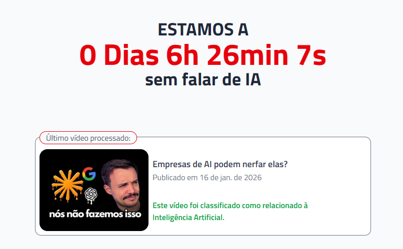

# ⏱️ Há quanto tempo o Lucas Montano está sem falar de IA?

Um site simples que mostra **há quanto tempo o Lucas Montano está sem falar sobre Inteligência Artificial no YouTube**.

O contador é atualizado automaticamente quando um novo vídeo é publicado e identificado como sendo sobre IA.

---

## 🧠 Como funciona

1. O site acompanha o canal do YouTube do Lucas Montano
2. Periodicamente, um job roda para verificar se há vídeos novos
3. Para cada vídeo novo:
   - Coleta título e thumbnail
   - Usa um modelo de IA para decidir se o vídeo é sobre IA
4. Se o vídeo for identificado como sendo sobre IA:
   - 🔄 o contador zera
   - 📜 o evento é salvo no histórico

---

## ✨ Funcionalidades atuais

- ⏱️ Contador em tempo real (dias, horas, minutos, segundos)
- 📺 Exibição do último vídeo analisado
- 🤖 Classificação automática assistida por IA
- 🗂️ Histórico de vídeos analisados
- 🔐 Rotas sensíveis protegidas por secret
- ☁️ Arquitetura serverless e simples

---

## 🛠️ Stack

- **Next.js (App Router)**
- **React**
- **Tailwind CSS**
- **MongoDB Atlas**
- **Gemini (Google AI)** – classificação de conteúdo
- **GitHub Actions / Scheduler externo** – cron job
- **Vercel** – deploy e hosting

---

## 📦 Estrutura geral do projeto

app/  
├─ api/  
│ ├─ state/ # Estado atual do contador  
│ └─ check/ # Checagem de novos vídeos  
├─ page.tsx # Página principal  
└─ components/

lib/  
└─ mongo.ts # Conexão com MongoDB

---

## 🔐 Variáveis de ambiente

Crie um arquivo `.env.local` na raiz do projeto:

MONGODB_URI=your_mongo_connection_string  
CRON_SECRET=your_random_secret  
GEMINI_API_KEY=your_gemini_key

⚠️ **Nunca exponha secrets no client.**

---

## ⏰ Cron job

Como o plano free da Vercel limita cron jobs, este projeto usa um **scheduler externo** (por exemplo, GitHub Actions) para chamar o endpoint:

POST /api/check

Com o header:

x-cron-secret: CRON_SECRET

---

## 🧪 Rodando localmente

npm install  
npm run dev

Depois acesse:

http://localhost:3000

---

## 🚧 Próximos passos (ideias)

- 🗳️ Sistema de votação da comunidade
- 🏆 Ranking / recordes históricos

---

## ❤️ Créditos

Criado por **Filipi Martins**  
Projeto experimental, simples e feito por diversão
